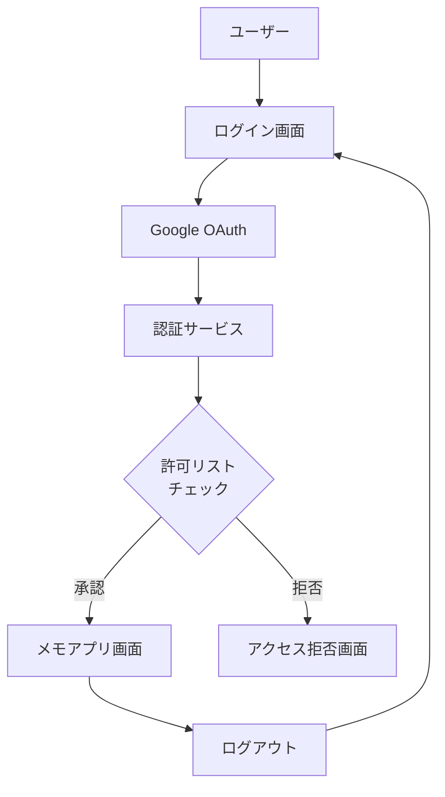
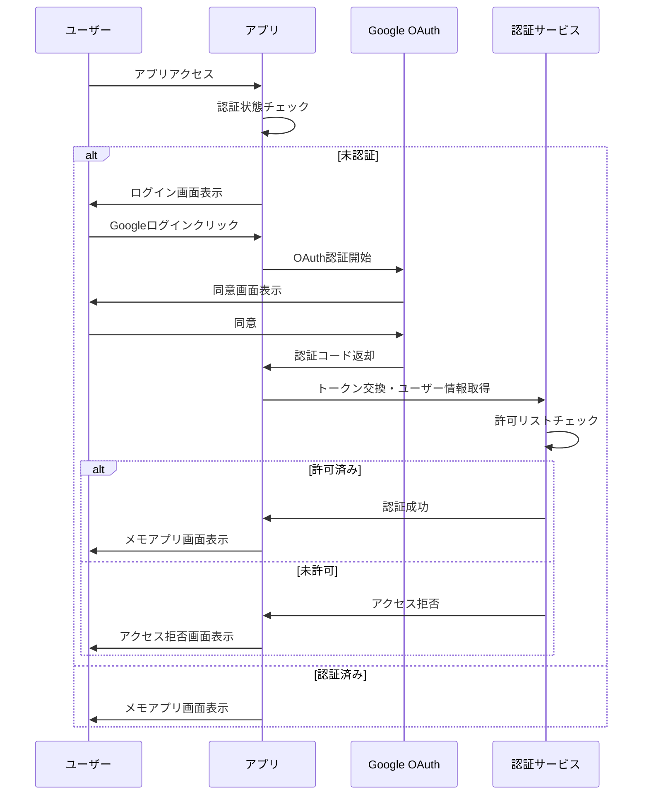

# 設計書

## 概要

メモアプリケーションに Google OAuth 認証機能を統合し、開発者制御のアクセス管理を実装します。既存の React アプリケーションに認証レイヤーを追加し、認証状態に基づいた画面遷移を実現します。Google OAuth 2.0 を使用してユーザー認証を行い、設定ファイルベースの許可リスト機能により、承認されたユーザーのみがアプリケーションにアクセスできるようにします。

## アーキテクチャ

### 全体構成



### 認証フロー



## コンポーネントとインターフェース

### 新規コンポーネント

#### 1. AuthProvider

- **役割**: 認証状態の管理とコンテキスト提供
- **機能**:
  - Google OAuth 認証の実行
  - 認証状態の永続化
  - 許可リストチェック
  - トークンリフレッシュ

#### 2. LoginPage

- **役割**: ログイン画面の表示
- **機能**:
  - Google ログインボタン
  - エラーメッセージ表示
  - 認証済みユーザーの自動リダイレクト

#### 3. ProtectedRoute

- **役割**: 認証が必要なルートの保護
- **機能**:
  - 認証状態チェック
  - 未認証時のリダイレクト

#### 4. LogoutButton

- **役割**: ログアウト機能
- **機能**:
  - 認証状態のクリア
  - Google セッションの取り消し

### 既存コンポーネントの変更

#### App.tsx

- AuthProvider でラップ
- 認証状態に基づく画面遷移ロジック追加
- ログアウトボタンの統合

#### Layout

- ログアウトボタンの追加

## データモデル

### 認証関連の型定義

```typescript
// ユーザー情報
interface User {
  id: string;
  email: string;
  name: string;
  picture?: string;
}

// 認証状態
interface AuthState {
  isAuthenticated: boolean;
  user: User | null;
  isLoading: boolean;
  error: string | null;
}

// Google OAuth レスポンス
interface GoogleAuthResponse {
  access_token: string;
  id_token: string;
  expires_in: number;
  refresh_token?: string;
}

// 許可リスト設定
interface AllowlistConfig {
  allowedEmails: string[];
  version: string;
}
```

### 設定ファイル構造

```json
// public/auth-config.json
{
  "googleClientId": "YOUR_GOOGLE_CLIENT_ID",
  "allowedEmails": ["developer@example.com", "user@example.com"],
  "version": "1.0.0"
}
```

## エラーハンドリング

### エラータイプ

```typescript
enum AuthErrorType {
  OAUTH_FAILED = "OAUTH_FAILED",
  ACCESS_DENIED = "ACCESS_DENIED",
  NETWORK_ERROR = "NETWORK_ERROR",
  TOKEN_EXPIRED = "TOKEN_EXPIRED",
  CONFIG_ERROR = "CONFIG_ERROR",
}

interface AuthError {
  type: AuthErrorType;
  message: string;
  retryable: boolean;
}
```

### エラー処理戦略

1. **OAuth 失敗**: ユーザーフレンドリーなメッセージと再試行オプション
2. **アクセス拒否**: 明確な説明とサポート連絡先
3. **ネットワークエラー**: 自動再試行と手動再試行オプション
4. **トークン期限切れ**: 自動リフレッシュまたは再認証
5. **設定エラー**: 開発者向けの詳細なエラー情報

## セキュリティ考慮事項

### トークン管理

- アクセストークンはメモリ内に保存
- リフレッシュトークンは Secure HttpOnly Cookie に保存（可能な場合）
- ローカルストレージには最小限の情報のみ保存

### 許可リスト管理

- 設定ファイルは公開ディレクトリに配置（メールアドレスのみ）
- 機密情報は含めない
- バージョン管理で変更履歴を追跡

### CSRF 対策

- Google OAuth の state parameter を使用
- ランダムな nonce の生成と検証

## テスト戦略

### 単体テスト

- 認証フック（useAuth）のテスト
- 許可リストチェック機能のテスト
- エラーハンドリングのテスト

### 統合テスト

- 認証フロー全体のテスト
- 画面遷移のテスト
- エラーシナリオのテスト

### E2E テスト

- ログイン・ログアウトフローのテスト
- 許可・拒否シナリオのテスト
- セッション持続性のテスト

### モック戦略

- Google OAuth API のモック
- ローカルストレージのモック
- ネットワークエラーのシミュレーション

## 実装詳細

### Google OAuth 設定

- Google Cloud Console でプロジェクト作成
- OAuth 2.0 クライアント ID の設定
- 許可されたリダイレクト URI の設定

### 依存関係

- `@google-cloud/oauth2`: Google OAuth 実装
- または軽量な代替ライブラリ

### 環境変数

```
VITE_GOOGLE_CLIENT_ID=your_client_id_here
VITE_AUTH_CONFIG_URL=/auth-config.json
```

### ビルド時考慮事項

- 設定ファイルの適切な配置
- 環境変数の注入
- プロダクションビルドでのデバッグ情報除去
